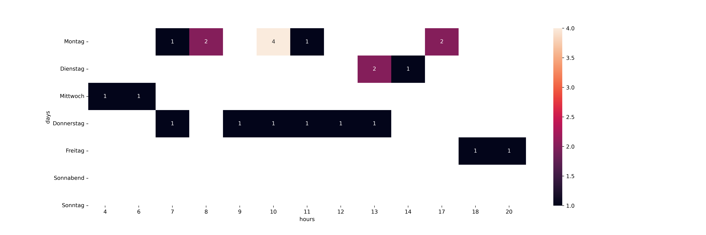

<!--
author:   _
email:    _

version:  0.0.1
language: en

-->

# Github Classroom Monitor

This is a periodically updated summary of Github Classroom activity report covering the following repositories

<!-- data-type="none" -->
|    | Team name   |   Task nummer | Repository URL                                                                                               |
|---:|:------------|--------------:|:-------------------------------------------------------------------------------------------------------------|
|  0 | camo        |             3 | [Link](git://github.com/Ifi-Softwareentwicklung-SoSe2021/softwareentwicklung_aufgabe3_sose2021_mb-camo.git)  |
|  1 | heoe        |             3 | [Link](git://github.com/Ifi-Softwareentwicklung-SoSe2021/softwareentwicklung_aufgabe3_sose2021_mb-heoe.git)  |
|  2 | jado        |             3 | [Link](git://github.com/Ifi-Softwareentwicklung-SoSe2021/softwareentwicklung_aufgabe3_sose2021_mb-jado.git)  |
|  3 | jury        |             3 | [Link](git://github.com/Ifi-Softwareentwicklung-SoSe2021/softwareentwicklung_aufgabe3_sose2021_mb-jury.git)  |
|  4 | lote        |             3 | [Link](git://github.com/Ifi-Softwareentwicklung-SoSe2021/softwareentwicklung_aufgabe3_sose2021_mb-lote.git)  |
|  5 | mavi        |             3 | [Link](git://github.com/Ifi-Softwareentwicklung-SoSe2021/softwareentwicklung_aufgabe3_sose2021_mb-ma-vi.git) |
|  6 | roma        |             3 | [Link](git://github.com/Ifi-Softwareentwicklung-SoSe2021/softwareentwicklung_aufgabe3_sose2021_mb-roma.git)  |
|  7 | s           |             3 | [Link](git://github.com/Ifi-Softwareentwicklung-SoSe2021/softwareentwicklung_aufgabe3_sose2021_mb-s.git)     |
|  8 | svph        |             3 | [Link](git://github.com/Ifi-Softwareentwicklung-SoSe2021/softwareentwicklung_aufgabe3_sose2021_mb-svph.git)  |
|  9 | vbm         |             3 | [Link](git://github.com/Ifi-Softwareentwicklung-SoSe2021/softwareentwicklung_aufgabe3_sose2021_mb-vbm.git)   |

----------------------------------------------------- 

Last update: 2021-07-18 17:42:58.085749

## Activity overview

The individual projects can be characterized by the individual fingerprints summarizing the existence and counts of different Github concepts.

<!-- data-type="none" -->
|    | Team   |   Commits |   Branches |   Issues |   PullRequests |   Releases |
|---:|:-------|----------:|-----------:|---------:|---------------:|-----------:|
|  0 | camo   |        11 |          1 |        0 |              1 |          0 |
|  1 | heoe   |         6 |          2 |        0 |              1 |          0 |
|  2 | jado   |        15 |          3 |        3 |              5 |          3 |
|  3 | jury   |         1 |          1 |        0 |              0 |          0 |
|  4 | lote   |        11 |          2 |        1 |              1 |          1 |
|  5 | mavi   |         1 |          1 |        0 |              0 |          0 |
|  6 | roma   |        11 |          2 |        1 |              1 |          1 |
|  7 | s      |         1 |          1 |        0 |              0 |          0 |
|  8 | svph   |         1 |          1 |        0 |              0 |          0 |
|  9 | vbm    |         1 |          1 |        0 |              0 |          0 |

## Working time analysis

The students commited new versions of the repositories during the following hours:

